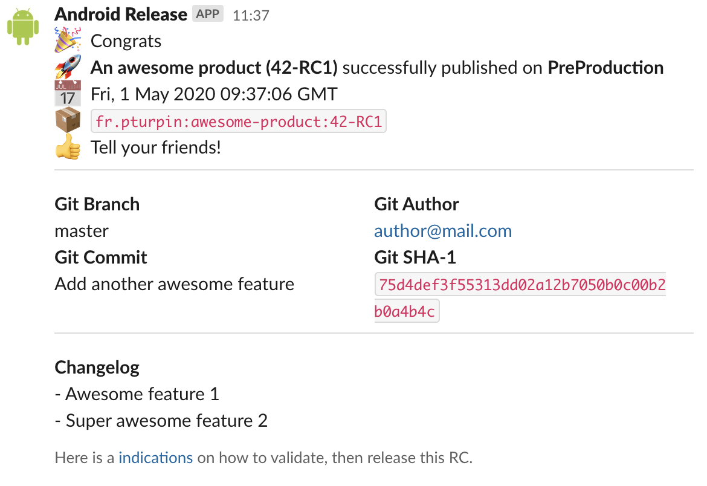

# slack-publish
[](https://gitlab.com/TurpIF/slack-publish/commits/master)
[](https://gitlab.com/TurpIF/slack-publish/)
[](https://plugins.gradle.org/plugin/fr.pturpin.slack-publish)

This plugin helps teams by automating their Slack notifications about a product. Slack messages are prepared in the
`build.gradle` file, and sent accordingly to the configured build lifecycle.

Here are some examples of how this plugin can be handy:
- Notify QA channel for verifying and testing a new RC, with embedded instructions on how to get the RC.
- Alert stakeholders when a product is released on production, with changelog.



It is oriented towards deployment, but you're free to prepare any kind of message you want to send (for instance when
you build your project after 21h):


## Configure a Slack WebHook

First you need to set up a Slack WebHook, so the plugin can use it.

- Go to *your_team*.slack.com/services/new/incoming-webhook
- Select the channel you want to send messages to (with the plugin, you can reconfigure this per message)
- Press Add Incoming WebHooks Integration
- Grab your WebHook URL

## Usage

### Install the plugin into Gradle

Open your `build.gradle` or `build.gradle.kts` file and add this code to load the plugin. 

```kotlin
plugins {
    id("fr.pturpin.slack-publish") version "<latest version>"
}
```

### Declare the message tasks

You can declare many messages that could be sent to Slack. For each message you register, a gradle task is created:

```kotlin
slack {
    messages {
        register("dummy1") {
            webHook.set("my webhook")

            payload {
                // Configure the payload
            }
        }

        register("dummy2") {
            webHook.set("same or another webhook")

            payload {
                // Configure the payload
            }
        }
    }
}
```

This produce two tasks that you can call manually:

```shell
./gradlew sendDummy1MessageToSlack
./gradlew sendDummy2MessageToSlack
```

Or you can link the task to the task graph:

```kotlin
tasks {
    check {
        finalizedBy(named("sendDummy1MessageToSlack"))
    }
}
```

### Configure the message payload

Payload is configured via the `payload` directive. Inside this directive, you have access to a `Payload` object that
you can mutate the shape your message. This payload object is part of the
[Slack API Model](https://github.com/slackapi/java-slack-sdk/blob/master/slack-api-model/src/main/java/com/slack/api/webhook/Payload.java).
So you have the full control over your message. Blocks, sections, fields, buttons, are possible. Please take a look at
[Slack messaging doc](https://api.slack.com/messaging) for advanced messaging.

The plugin provides some helper methods to help with composing your messages:
- `block` directive inserts a new [block](https://api.slack.com/reference/block-kit/blocks) in the payload (with or without a divider above)
- `section` directive inserts a new [section](https://api.slack.com/reference/block-kit/blocks#section) in the payload
- `fields` directive inserts a new [section](https://api.slack.com/reference/block-kit/blocks#section) in the payload with fields
- `context` directive inserts a new [context block](https://api.slack.com/reference/block-kit/blocks#context) in the payload

```kotlin
import com.slack.api.model.block.Blocks.context
import com.slack.api.model.block.composition.BlockCompositions.markdownText

slack {
    messages {
        register("dummy") {
            payload {
                // Configure meta information:
                channel = "#alerts"
                username = "Good Bot"
                iconEmoji = ":robot:"

                // Or take full control over the payload
            }

            section {
                text = markdownText("This is my *first* section :+1:")
            }

            fields {
                insertDivider.set(false)
                field(":rocket:", "Field 1")
                field(":tada:", "Field 2")
            }

            context {
                markdown("A context line")
                image("http://my.image/path", "alt text")
            }

            block(insertDivider = false) {
                // Do unsupported operations
            }
        }
    }
}
```

The directives are executed sequentially, so you can read the message from top to bottom as expected. Also, everything
declared inside them are lazy. They are stored during configuration and executed only when the task is triggered. So you
do not have to worry about the placement of the messages in the gradle file.

### Using helper blocks

The plugin brings few helper blocks to help you to compose useful messages about your project.

#### Insert Git information

You can insert information about your git repository, such as the current branch, the last commit info, ...

```kotlin
slack {
    messages {
        register("git") {
            git {
                root.set("../my-git")

                format {
                    // To customize the format
                }
            }
        }
    }
}
```

The configuration is optional:
- `root` property is your project directory by default, and if no git repository is
found, parent directories will be checked.
- `format` allows you to customize the inserted payload, by having access to git data.

#### Insert publication information

You can insert information about your artifacts.

```kotlin
tasks.withType<PublishToMavenRepository>() {
  slack {
    messages {
      register("${publication.name}DeployedTo${repository.name.capitalize()}") {
        publication {
          publicName.set("Awesome Product")
          publication(publication)
          repository(repository)
        }
      }
    }
  }
}
```

This generates a slack message task for all maven publication tasks you declared and set the appropriate properties such
as the group ID, artifact ID, version, repository name, product public name.

## Insert changelog information

You can insert the changelog specific to your project version.

```kotlin
slack {
    message {
        register("dummy") {
            changelog {
                versionLinesStartWith("##")
            }
        }
    }
}
```

Version section are extracted by recognizing lines declaring new version. For example, given a `CHANGELOG.md` file
containing:

```markdown
## Version 2.0.2

 - Fix 1

## Version 2.0.1

  - Feature 1
    - Feature 1.a
    - Feature 1.b
  - Feature 2
  - ...
  
## Version 2.0.0

  - ...
```

If the project version is `2.0.1`, then this will be extracted:

```markdown
- Feature 1
  - Feature 1.a
  - Feature 1.b
- Feature 2
- ...
```